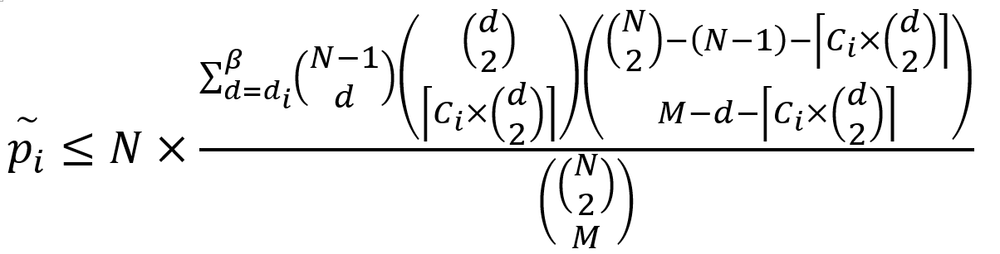
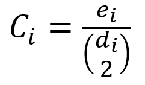
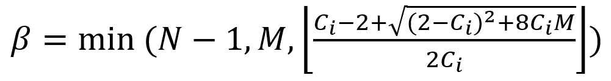
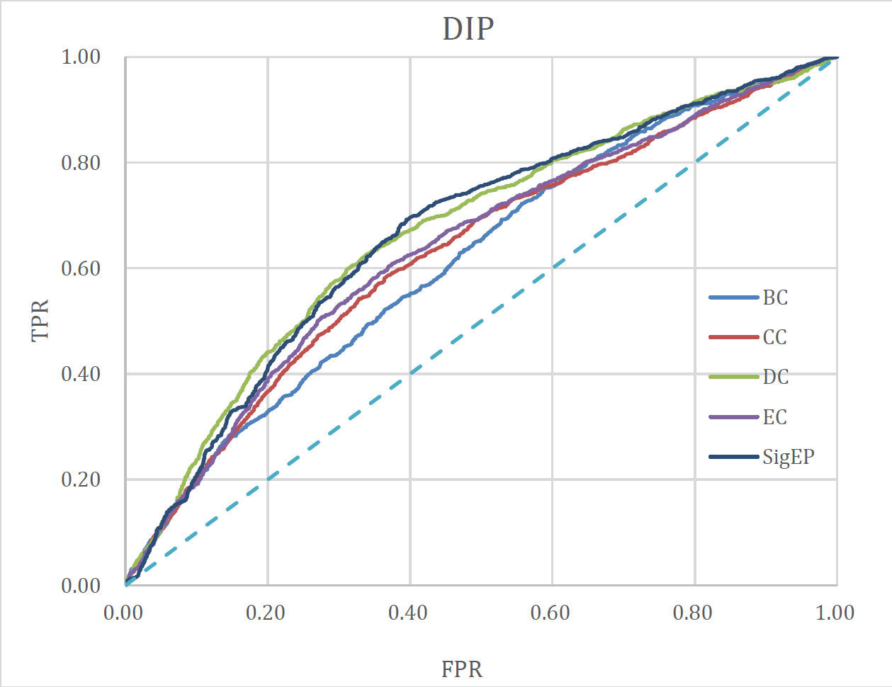
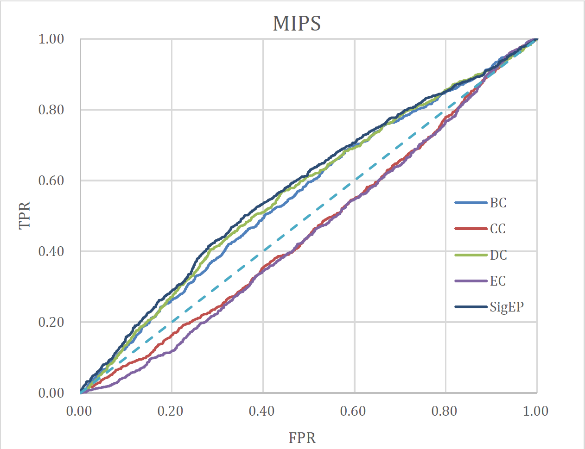
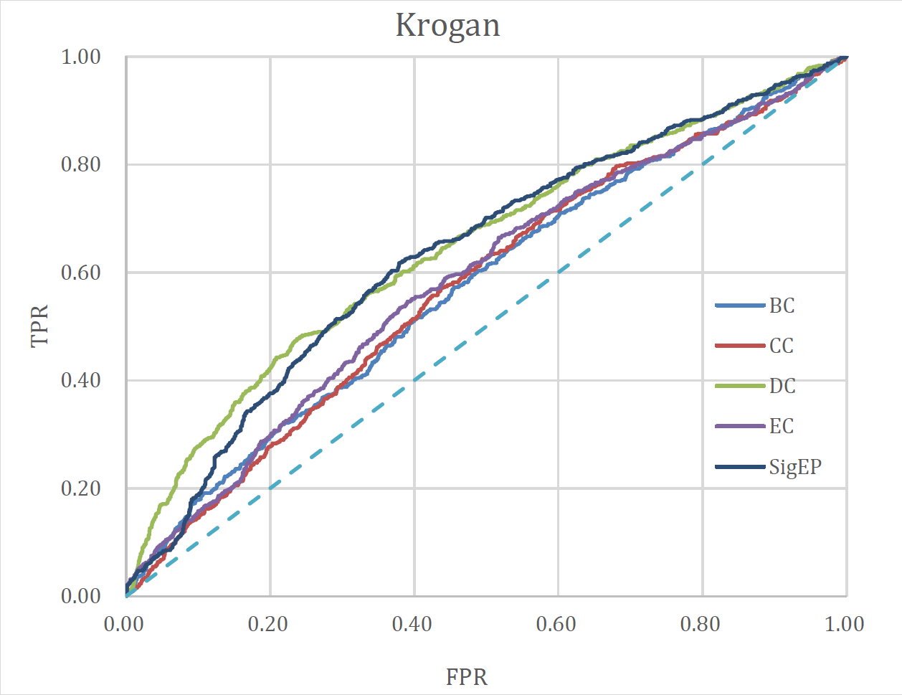
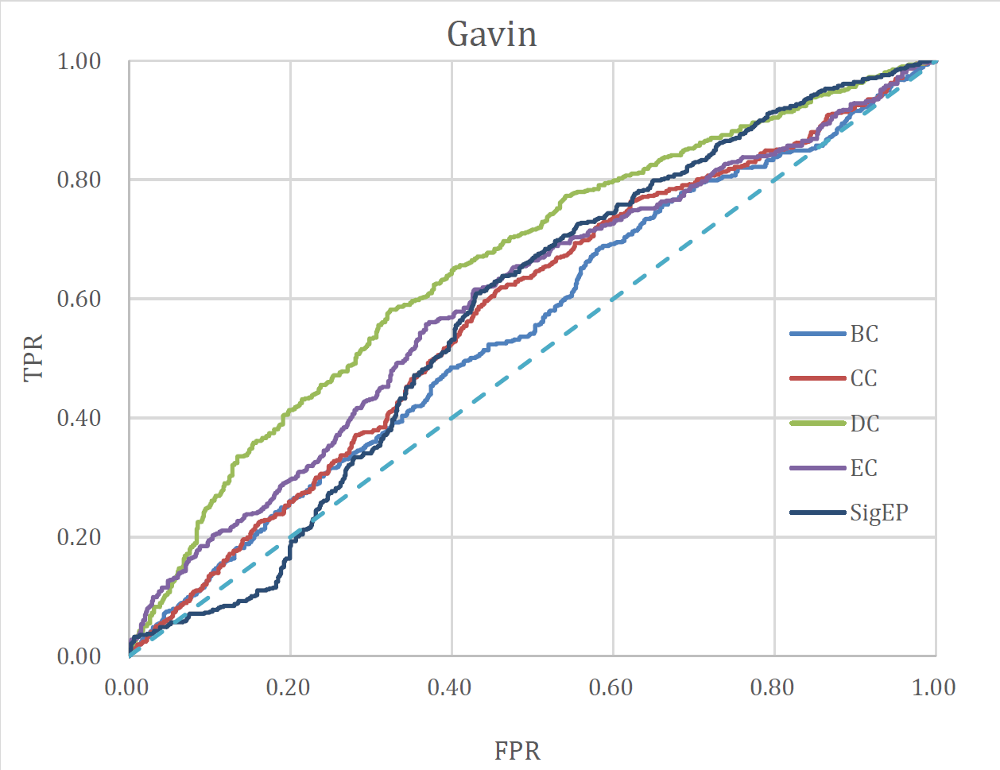

This program aims to find out the essential proteins in the Protein Network and evaluate its accuracy by comparing with prepared reference data. 

**As a sample, we use 5 algorithms which are shown below:**

- Betweenness Centrality (BC)
- Closeness Centrality (CC)
- Degree Centrality (DC)
- Eigenvector Centrality (EC)
- Significance-Based Essential Protein Discovery (SigEP) \*

**And 4 data sets:**

| Network | Proteins | Interactions | Density |
| :-----: | :------: | :----------: | :-----: |
|   DIP   |   5093   |    24743     | 0.0019  |
|  MIPS   |   4546   |    12319     | 0.0012  |
| Krogan  |   2674   |     7075     | 0.0020  |
|  Gavin  |   1430   |     6531     | 0.0064  |

As a result of various experiment, it indicates that there is no "best" algorithm but a "better suitable" one.

**Details are shown in the last part.**

# Help

Use **'-h'** to show:

```
===== Center Protein Calc =====

Usage: [option] <value>
-h See this.
-i Specific input data path.
-r Specific reference data path.
-s (optional) Specific step (default 1).
-a Use 5 centrality algorithms together (BC, CC, DC, EC, SigEP).
-b Use algorithm Betweenness Centrality (BC).
-c Use algorithm Closeness Centrality (CC).
-d Use algorithm Degree Centrality (DC).
-e Use algorithm Eigenvector Centrality (EC).
-p Use algorithm Significance-Based Essential Protein Discovery (SigEP).

=========== Caution ===========

Must have at least one of ['-a', '-b', '-c', '-d', '-e', '-p'].
Must have '-r' and 'your refer data's path'.
Must have '-i' and  'your input data's path'.

============ Tips ============

Algorithm BC or CC will take a long trip to run (like O(N^3)), but it works!
Use '-b -c' together (save you 50% time)

============ About ============

Author: bipy@GitHub
Version: 20200725.1
```

**BC** and **CC** use "floyd" algorithm to calculate all the vertex, this precedure might take some time.

Luckily they share the same result of floyd, so use **'-b'** and **'-c'** together and gain a tea time : )

# \*About SigEP

## Introduction

SigEP can identity the essential proteins from Protein-Protein Interaction network: we present a p-value calculation method for quantifying the statistical significance of each protein by considering both its degree and local clustering coefficient. To reduce the computational cost, we further present an upper bound of the p-value, which is less timeconsuming in practice. After calculating the p-value for each protein, we control the FDR of identified essential proteins using the well-known BH algorithm.

## Reference

Liu, Y., Liang, H., Zou, Q., & He, Z. (2020). Significance-Based Essential Protein Discovery. *IEEE/ACM Transactions on Computational Biology and Bioinformatics*.

## Calculate



Where *Ci* repersents the local clustering coefficient of the *i* th node, which is defined as:



*d* is the degree of the node and *e* is the  number of edges among the *d* neighbors of the node.

And *beta*, the upper bound:



# Build

**Requirement:** G++ 6.5.0 or higher (No third party library included)

**Command:**

```shell
g++ Essential-Proteins.cpp -std=c++14 -o Essential-Proteins.exe
```

# Usage

Run DC and EC!

```shell
Essential-Proteins.exe -d -e -r "Reference essential proteins.txt" -i "original dip.txt"
```

Run 5 algorithms together!

```shell
Essential-Proteins.exe -a -r "Reference essential proteins.txt" -i "original dip.txt"
```

Run 5 algorithms together and specific step!

```shell
Essential-Proteins.exe -a -s 5 -r "Reference essential proteins.txt" -i "original dip.txt"
```

# Result

## DIP



## MIPS



## Krogan



## Gavin


